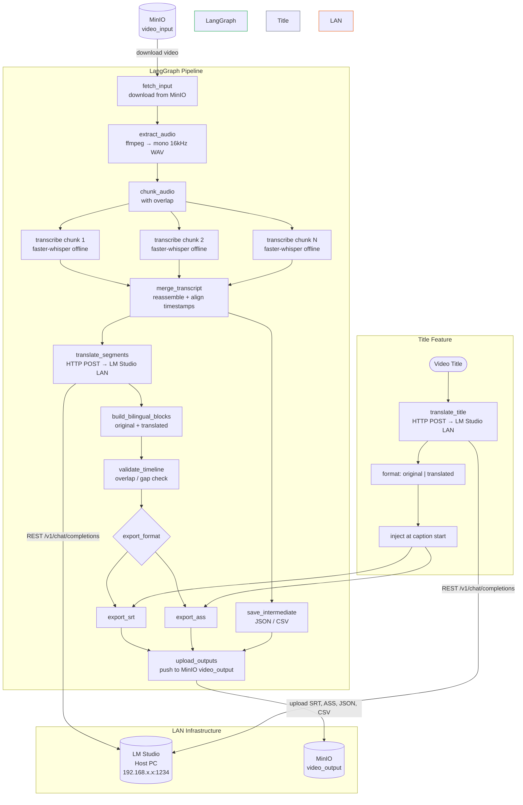

# Video Caption Assistant — Project Roadmap

## Overview

A fully **offline-first**, LangGraph-orchestrated pipeline that extracts audio from video, transcribes it locally with faster-whisper, translates captions via a **LM Studio instance running on the LAN** (OpenAI-compatible REST API), and exports SRT/ASS caption files. A secondary feature auto-translates the video title and prepends it inside the caption file.

---

## Architecture Decision

| Concern | Choice | Reason |
|---------|--------|--------|
| Orchestration | **LangGraph** | Stateful graph with retry, branching, and parallel node execution |
| Transcription | **faster-whisper (local)** | Fully offline; CTranslate2 engine; word-level timestamps |
| Translation | **LM Studio via LAN REST API** | Self-hosted LLM; OpenAI-compatible `/v1/chat/completions`; zero cloud cost |
| Audio extraction | **ffmpeg** | Universal; handles all container formats |
| Caption export | **pysrt + custom ASS writer** | SRT standard; ASS for styled subtitles |
| Object storage | **MinIO** | S3-compatible self-hosted storage; `video_input` + `video_output` buckets |

---

## Feature Scope

| # | Feature | Description |
|---|---------|-------------|
| 1 | Audio extraction | Extract audio track from video via ffmpeg |
| 2 | Audio chunking | Split audio into parallel-processable segments with overlap |
| 3 | Speech recognition | Transcribe each chunk offline with faster-whisper (word timestamps) |
| 4 | Chunk merging | Reassemble ordered transcript with global timestamps |
| 5 | Translation | Translate segments via LM Studio LAN REST API |
| 6 | Bilingual captions | Merge original + translated text per caption block |
| 7 | Timeline validation | Detect overlapping or malformed caption intervals |
| 8 | Caption export | Write SRT / ASS output files |
| 9 | Intermediate storage | Save raw transcript + metadata as JSON or CSV |
| 10 | Title translation | Translate video title via LM Studio, append to original, inject at caption start |

---

## Roadmap Phases

### Phase 1 — Infrastructure & LangGraph Setup
- [ ] Set up LangGraph state schema (`CaptionState`)
- [ ] Define graph skeleton: nodes + edges
- [ ] LM Studio LAN client — configurable `base_url` (e.g. `http://192.168.x.x:1234/v1`) + health check
- [ ] faster-whisper model loading with configurable model size and device (`cpu` / `cuda`)
- [ ] MinIO client setup — `video_input` and `video_output` bucket provisioning
- [ ] TOML config for LAN host, port, model name, whisper model size, MinIO endpoint

### Phase 2 — Core Transcription Pipeline (LangGraph nodes)
- [ ] `fetch_input` node: download video from MinIO `video_input` bucket
- [ ] `extract_audio` node: video → mono 16 kHz WAV via ffmpeg
- [ ] `chunk_audio` node: split with configurable chunk size + overlap
- [ ] `transcribe_chunks` node: parallel faster-whisper inference (word-level timestamps)
- [ ] `merge_transcript` node: reassemble chunks, align global timestamps
- [ ] `save_intermediate` node: persist raw transcript to JSON / CSV; upload to MinIO `video_output`

### Phase 3 — Translation via LM Studio (LangGraph nodes)
- [ ] `translate_segments` node: batch REST calls to LM Studio `/v1/chat/completions`
- [ ] Configurable system prompt for translation style/tone
- [ ] Retry logic on network timeout (LAN reliability)
- [ ] `build_bilingual_blocks` node: zip original + translated segments

### Phase 4 — Caption Export & Validation (LangGraph nodes)
- [ ] `validate_timeline` node: gap detection, overlap check, max duration guard
- [ ] `export_srt` node: write `.srt` file; upload to MinIO `video_output`
- [ ] `export_ass` node: write `.ass` file with basic styling; upload to MinIO `video_output`
- [ ] `upload_outputs` node: push all output files (SRT, ASS, CSV, JSON) to `video_output` bucket

### Phase 5 — Title Translation Feature
- [ ] `translate_title` node: send title to LM Studio, receive translated title
- [ ] Format: `Original Title | 译文标题`
- [ ] Inject title block at timestamp `00:00:00,000 --> 00:00:05,000` in caption files

### Phase 6 — CLI & Polish
- [ ] CLI via `typer`: `uv run main.py --video ... --lang zh --format srt`
- [ ] LAN connectivity check at startup with clear error message
- [ ] Progress reporting (per-node status)
- [ ] Batch video support
- [ ] Config file override via CLI flag

---

## Models

### Speech Recognition — Offline Only

| Model | Backend | Notes |
|-------|---------|-------|
| **faster-whisper large-v3** | CTranslate2 (local) | Best accuracy; word timestamps; recommended |
| faster-whisper medium | CTranslate2 (local) | 2× faster than large-v3; good quality |
| faster-whisper small | CTranslate2 (local) | Fastest; suitable for short clips or drafts |

All models download once from HuggingFace Hub and run fully offline after that.
GPU (CUDA) recommended for large-v3; CPU works for smaller models.

### Translation — LM Studio (LAN)

Any model loaded in LM Studio that supports the OpenAI-compatible chat API. Recommended models for translation quality:

| Model | Size | Notes |
|-------|------|-------|
| **Qwen2.5-7B-Instruct** | ~5 GB | Excellent Chinese ↔ English; fast on modern GPUs |
| Mistral-7B-Instruct-v0.3 | ~5 GB | Strong multilingual; good instruction following |
| Llama-3.1-8B-Instruct | ~6 GB | Balanced quality; broad language support |
| Gemma-2-9B-Instruct | ~7 GB | High quality; good for formal/subtitle register |
| DeepSeek-R1-Distill-Qwen-7B | ~5 GB | Strong reasoning; good at preserving nuance |

LM Studio exposes all models at `http://<LAN_IP>:<PORT>/v1/chat/completions` — no code change needed to switch models, just swap the model name in config.

---

## Tech Stack

| Layer | Choice | Purpose |
|-------|--------|---------|
| Language | Python 3.12 | Runtime |
| Package manager | uv | Dependency + venv management |
| Orchestration | `langgraph` | Stateful pipeline graph with parallel nodes |
| Audio extraction | `ffmpeg-python` + ffmpeg binary | Video → WAV conversion |
| Transcription | `faster-whisper` | Offline Whisper inference with CTranslate2 |
| Translation client | `httpx` | Async REST calls to LM Studio LAN endpoint |
| LLM interface | `langchain-openai` (OpenAI-compat) | Wraps LM Studio REST; reuses LangChain tooling |
| Parallelism | LangGraph parallel nodes + `asyncio` | Parallel chunk transcription and translation |
| Object storage | `minio` (Python SDK) | S3-compatible client for MinIO; input/output buckets |
| Caption I/O | `pysrt`, custom ASS writer | SRT/ASS read-write |
| Data storage | `json`, `csv` (stdlib) | Intermediate transcript storage |
| CLI | `typer` | Command-line interface |
| Config | `tomllib` (stdlib 3.12) | TOML config parsing |
| Testing | `pytest` + `pytest-asyncio` | Unit + integration tests |

---

## LM Studio LAN Configuration

LM Studio on the host PC must have **Local Server** enabled:

```
Settings → Local Server → Start Server
Expose on local network: ON
Port: 1234 (default, configurable)
```

Client config in `config.toml`:

```toml
[lm_studio]
base_url = "http://192.168.1.100:1234/v1"
model = "qwen/qwen3.5-9b"
timeout = 60          # seconds; increase for slow hardware
max_retries = 3
```

The `httpx` / `langchain-openai` client points to this base URL — identical interface to OpenAI API.

---

## MinIO Storage Layout

```
MinIO
├── video_input/          ← drop videos here to trigger processing
│   └── my_video.mp4
└── video_output/
    └── my_video/
        ├── my_video.srt
        ├── my_video.ass
        ├── transcript.json
        └── transcript.csv
```

Start MinIO with Docker Compose:

```bash
docker compose up -d
# S3 API:     http://localhost:9000
# Web console: http://localhost:9001  (minioadmin / minioadmin)
```

Client config in `config.toml`:

```toml
[minio]
endpoint = "localhost:9000"        # or LAN IP if running on another host
access_key = "minioadmin"
secret_key = "minioadmin"
secure = false                     # true if TLS enabled
input_bucket = "video-input"
output_bucket = "video-output"
```

Pipeline behaviour:
- **Start:** `fetch_input` node downloads the target video from `video_input` to a local temp dir
- **End:** `upload_outputs` node pushes all generated files (SRT, ASS, JSON, CSV) to `video_output/<video_stem>/`
- Local temp files are cleaned up after successful upload

---

## Workflow



---

## Directory Structure (proposed)

```
video-caption-assistant/
├── main.py                      # CLI entry point (typer)
├── pyproject.toml
├── .python-version
├── config.toml                  # LM Studio LAN config, model sizes
├── road_map/
│   └── ROADMAP.md
└── src/
    └── video_caption/
        ├── graph.py             # LangGraph graph definition + compilation
        ├── state.py             # CaptionState TypedDict
        ├── nodes/
        │   ├── extractor.py     # extract_audio node
        │   ├── chunker.py       # chunk_audio node
        │   ├── transcriber.py   # transcribe_chunks node (faster-whisper)
        │   ├── assembler.py     # merge_transcript node
        │   ├── translator.py    # translate_segments node (LM Studio REST)
        │   ├── builder.py       # build_bilingual_blocks node
        │   ├── validator.py     # validate_timeline node
        │   ├── title.py         # translate_title node
        │   └── exporters/
        │       ├── srt.py       # export_srt node
        │       └── ass.py       # export_ass node
        └── clients/
            ├── lm_studio.py     # httpx client for LM Studio LAN REST API
            └── minio_client.py  # MinIO SDK wrapper (upload / download / bucket init)
```
